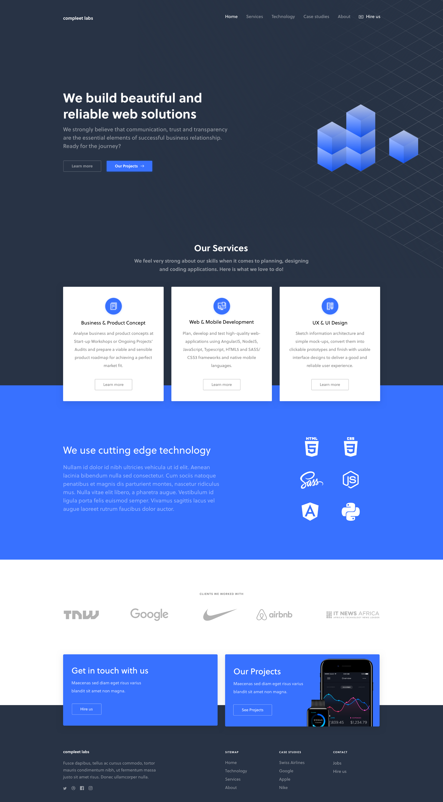

# Frontend Challenge

¡Hola! Soy Sol Olmos y estoy emocionada de presentarte mi proyecto realizado como parte del desafío frontend de DOMO.

## Descripción del Desafío

Este proyecto surge como respuesta a un desafío de desarrollo web frontend. La tarea consiste en maquetar una página de una sola página (one page) utilizando Bootstrap CSS y React, y agregar animaciones con Framer Motion. La inspiración para la maqueta proviene de una imagen proporcionada como referencia.

## Mi Enfoque

Para abordar este desafío, me enfoqué en utilizar las herramientas proporcionadas, como Bootstrap CSS para la maquetación y React para la estructura del proyecto. Además, aproveché las capacidades de Framer Motion para añadir animaciones y darle vida a la página.

## Evaluación

Durante el proceso de desarrollo, me aseguré de cumplir con los criterios de evaluación establecidos:

- Utilicé Bootstrap CSS de manera efectiva para garantizar la responsividad de la página.
- Me esforcé por lograr una alta fidelidad entre la maqueta y la imagen proporcionada.
- Apliqué JavaScript para agregar interactividad y detalles adicionales a la página.
- Presté especial atención a los detalles para asegurar una entrega de calidad.

Además de cumplir con los requisitos básicos del desafío, busqué agregar un toque personal y creativo a mi trabajo. Utilicé animaciones, agregué detalles interesantes y me esforcé por destacar mi conocimiento y habilidades en el desarrollo web frontend.

## Deploy del Proyecto

Si querés ver cómo quedó mi maqueta, podes verla aca: https://domopage.vercel.app/

